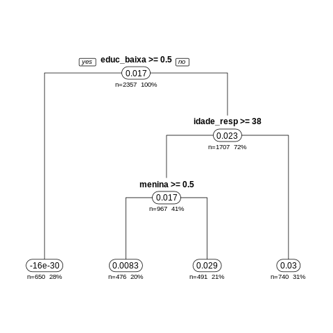

# Motivação 


Ao revisitar o histórico dos nossos projetos, que usam mensagens SMS e conceitos da economia comportamental para provocar mudança de comportamento e assim gerar impacto social, constatamos que boa parte do impacto que potencialmente conseguiríamos causar não chega aos beneficiários, pelo simples fato de existir uma limitaçao de não sabermos qual é o melhor conteúdo que devemos enviar, e qual a melhor forma de entregá-lo (que dia e horário? Usar linguagem formal ou informal? Mandar 1 ou 2 mensagens por semana?), dada as informações disponíveis e adaptação a novas situações. 

Para ilustrar este impacto potencial que estamos deixando de entregar, temos o gráfico abaixo, que foi retirado de um projeto real, em que cada participante foi sorteado para receber 1 de 24 variações possíveis de sequências de mensagens SMS. 

Ao final do projeto, foi calculado: 

1. O impacto da sequência de mensagens que o participante recebeu.
2. Qual teria sido o impacto se o mesmo participante tivesse recebido cada uma das outras 23 variações de mensagens. 

A partir disso, foi possível identificar qual das 24 sequências geraria o impacto máximo para cada participante e verificar se o participante recebeu a sequência de máximo impacto. Por exemplo, o impacto máximo para o participante $i$ poderia ter sido alcançado se ele tivesse recebido a variação 20, mas ele recebeu na realidade a variação 6.

O resultado dessa análise está no histograma, que mostra a proporção de participantes que efetivamente recebeu a sua sequência de máximo impacto. Por exemplo, entre os participantes que receberam a sequência 6, ela também era a sequência de máximo impacto para 30% deles. Isto significa que  os outros 70% poderiam ter seu impacto maximizado se tivessem recebido outra sequência.


# Prova de conceito

Nas próximas seções detalharemos os primeiros passos na construção da prova de conceito onde endereçaremos este problema por meio de uma abordagem com Inteligência Artificial. O objetivo em questão é usar uma informação valiosa que temos, que são as respostas que os participantes nos enviam em SMS, para construir um indicador de alta frequencia (proxy) que vai prever variações no impacto que estamos provocando. Com esse indicador, a ideia é que consigamos avaliar com alta frequência qual é o impacto que cada forma/conteúdo/linguagem de uma mensagem está provocando, e assim ir corrigindo o curso para conseguir entregar para cada perfil de participante o tipo de comunicação de maior impacto.

Nesta prova de conceito, usaremos dados reais de um projeto do Eduq+, nossa trilha de conteúdo para apoiar o engajamento de famílias na vida escolar dos alunos. O impacto das mensagens foi medido como aumento na nota de matemática.

# Introdução

Como mencionado acima, neste projeto os participantes poderiam receber uma dentre 24 versões de sequências de mensagens. As 24 versões (v1, v2, v3, ...) surgem como recortes de três tipos de variações: presença de um pergunta de interatividade (sim ou não), número de mensagens enviadas (1, 2 ou 3 por semana), horário de entrega (tarde ou noite) e consistência do horário de entrega (sim ou nao). 

Como precisamos das informações de respostas às interações, vamos deixar de fora todos os participantes que receberam alguma das 12 versões em que não havia perguntas de interação.


 


**Importante para o contexto**

- As notas de matemática tem frequência bimestral (neste caso, são as notas do 3o e 4o bimestre)
- As mensagens de interação chegam numa frequência semanal 


```
No momento, estamos estimando por meio de um único modelo, por bimestre. É importante avaliar, como próximo passo, diferentes modelos (estimadores) para cada semana.
```

# 0. Organização dos dados 

Antes de iniciar qualquer análise precisamos organizar nossa base de dados.

Algumas atividades envolvem: 

- Importar a base `dta` com os dados adminstrativos
- Fazer correções de nomes nas colunas 
- Criar as variáveis de tratamento
- Ler as mensagems SMS 
- Remover os dados duplicados 

```{r}
library(readstata13)
library(readxl)
library(dplyr)
library(genderBR)

# No scientif notation
options(scipen=999)

source('config.R')

### Read data

# Read outcomes data
dataset1=read.dta13(paste0(data.path,"diff_ago8.dta"))

# Read characteristics data
dataset2=read.dta13(paste0(data.path,"sms_escola_mar21.dta"))

# Create treatment variables
for(i in 1:24){
dataset1[,paste0("v",i)]=ifelse(dataset1$t_eduq==i,1,NA)
dataset1[,paste0("v",i)]=ifelse(dataset1$t_eduq==25,0,dataset1[,paste0("v",i)])
}

# Rename boeltim to boletim
names(dataset1)=gsub("bolteim","boletim",names(dataset1))
names(dataset2)=gsub("bolteim","boletim",names(dataset2))

# Select variables
select.vars=c("menina","idade","parda","preta","mae","idade_resp","parda_resp","preta_resp","educ_baixa","educ_EF","educ_EM","renda_1SM","renda_1a3SM","estrato_escola")

dataset2=dataset2[,c("ra",select.vars)]

# Read sms data
db.sms=read_excel(paste0(data.path,"interacoes_smsescola.xlsx"))

# Change "Resposta extra" to preceeding question
db.sms$extra_ans=ifelse(db.sms$question=="Resposta extra",1,0)
while(length(which(db.sms$question=="Resposta extra"))>0){
db.sms[which(db.sms$question=="Resposta extra"),]$question=db.sms[which(db.sms$question=="Resposta extra")-1,]$question
}

## Drop unnecessary data

dataset1$treat_cod=dataset1$t_eduq
dataset1=dataset1[,!grepl("t_eduq",names(dataset1))]
for(i in 1:4){dataset1[,paste0("boletim_lp",i)]=ifelse(dataset1$t!=i,NA,dataset1[,paste0("boletim_lp",i)])}

dataset1$boletim_lp=rowSums(dataset1[,paste0("boletim_lp",1:4)],na.rm=T)
dataset1=dataset1[,!names(dataset1)%in%paste0("boletim_lp",1:4)]
dataset1=dataset1[,!names(dataset1)%in%paste0("eduq_puro",1:3)]
dataset1=dataset1[,!names(dataset1)%in%c("s","boletim_mat_z","boletim_lp_z","t2")]

# Find phone-ra correspondence through another database

phone.ra=read.dta13(paste0(data.path,"/base_alunos_completa_dadossociodem_matched copy.dta"))
phone.ra=phone.ra %>% group_by(ra) %>% dplyr::summarise(phone=unique(celular))
phone.ra$phone=as.numeric(substring(phone.ra$phone,2,nchar(phone.ra$phone)))

# Merge phone.ra and dataset1
dataset1=merge(dataset1,phone.ra,by="ra",all.x=T)

# Merge dataset2 and dataset1
dataset=merge(dataset1,dataset2,by="ra",all.x=T)

# Drop obs

# eduq_freq - Tratamento Engajamento - Frequencia (frequency)
# eduq_time - Tratamento Engajamento - Hora do dia (time)
# eduq_feed - Tratamento Engajamento - Feedback (interactivity)

dataset=dataset[dataset$t%in%c(3,4),]
dataset=dataset[dataset$eduq_feed!=0,]
```

# 1. Feature selection space

Começamos desenvolvendo uma estratégia para usar os *inputs* que os participantes nos dão (respostas a interações, atualmente a cada duas semanas) para tentar prever quem se beneficiaria mais. 

```
Uma variável (feature) deve ser definida no sentido amplo da palavra. Por exemplo, uma variável pode contemplar elementos simples como a presença de determinadas palavras, como 'SIM', até fatores mais complexos como análise de sentimento. É importante destacar que não há limite de variáveis e idealmente o número de variáveis seja tão grande quanto a amostra.
```

Matematicamente, temos features $f(i,r)$

$$ f(i,r)=F(m_{i, r \ \in \ t}) $$, onde $m_{i, r \ \in \ t}$ são as mensagens em tempo real dentro do período $t$: semana, quinzena, mês. A função $F()$ captura alguma feature das mensagens como: número de caractéres, presença da palavra "sim", caixa alta.

À partir disso criamos estatíticas:

$$ I(i,r) = H(f_{i,r \ \in \ t}),$$ $r=tempo \ real$, onde $H(x)=(h_1(x),h_2(x),...,h_P(x))$ é um vetor com entradas $h_p: \digamma \to \Upsilon,\ p=\{1,2,...,P\}$, a função que leva do conjunto $\digamma$, que contém as features das mensagens do indivíduo $i$ em $r_1,r_2,...,r_q \ \in \ t$, ao conjunto $\Upsilon$ de estatísticas das features para cada $i$ em $t$ . A função $h_p()$ pode ser: média, mínimo, máximo, mediana, varíancia.

Em outras palavras: a idea é que a função $H(x)$ transforme vetores, que são as features das mensagens de cada indivíduo, em escalares, que são as estatísticas (média, máximo, etc.) definidas por nós.

Terminamos com $P$ estatísticas $I_p(i,t)$ para cada feature de mensagens no período $t$ de cada indíviduo $i$.

$$I_p(i,t)$$
, onde $p=$(média, mínimo, mediana,...)

```{r}

# Lower case
db.sms$lower=ifelse(!grepl("[[:lower:]]",db.sms$answer)==T,1,0)

# sinal de genero
db.sms$ans.boy=ifelse(grepl("*filho*",db.sms$answer,ignore.case = T)==T,1,0)
db.sms$ans.girl=ifelse(grepl("*filha*",db.sms$answer,ignore.case = T)==T,1,0)

# sinais de concordancia 
db.sms$ans.cool=ifelse(grepl("*legal*",db.sms$answer,ignore.case = T)==T,1,0)
db.sms$ans.thank=ifelse(grepl("*obrigado*",db.sms$answer,ignore.case = T)==T,1,0)
db.sms$ans.thank1=ifelse(grepl("*obg*",db.sms$answer,ignore.case = T)==T,1,0)
db.sms$ans.sure=ifelse(grepl("*com certeza*",db.sms$answer,ignore.case = T)==T,1,0)
db.sms$ans.truth=ifelse(grepl("*verdade*",db.sms$answer,ignore.case = T)==T,1,0)

# sinais de afeto
db.sms$ans.affection=ifelse(grepl("*carinho*",db.sms$answer,ignore.case = T)==T,1,0)
db.sms$ans.love=ifelse(grepl("*amo*",db.sms$answer,ignore.case = T)==T,1,0)
db.sms$ans.love1=ifelse(grepl("*ama*",db.sms$answer,ignore.case = T)==T,1,0)
db.sms$ans.friends=ifelse(grepl("*amizade*",db.sms$answer,ignore.case = T)==T,1,0)
db.sms$ans.feel=ifelse(grepl("*sentir*",db.sms$answer,ignore.case = T)==T,1,0)
# sinais de discordância
db.sms$ans.no=ifelse(grepl("*não*",db.sms$answer,ignore.case = T)==T,1,0)

# outras ideias 
db.sms$ans.math=ifelse(grepl("*matematica*",db.sms$answer,ignore.case = T)==T,1,0)
db.sms$ans.activity=ifelse(grepl("*atividade*",db.sms$answer,ignore.case = T)==T,1,0)
db.sms$ans.dream=ifelse(grepl("*sonho*",db.sms$answer,ignore.case = T)==T,1,0)
db.sms$ans.dream1=ifelse(grepl("*escola*",db.sms$answer,ignore.case = T)==T,1,0)

#

# Presence of "SIM"
db.sms$ans.yes=ifelse(grepl("*sim*",db.sms$answer,ignore.case = T)==T,1,0)

# Keep created variables
created.vars=names(db.sms)[(ncol.oldvars+1):ncol(db.sms)]

### Collapse sms dataset

# Change names
names(db.sms)[names(db.sms)=="semana"]="week"
names(dataset)[names(dataset)=="t"]="bimester"

# Create bimester variable
db.sms$bimester=ifelse(db.sms$week%in%1:9,3,NA)
db.sms$bimester=ifelse(db.sms$week%in%10:18,4,db.sms$bimester)

# Collapse
dataset.sms=db.sms %>% group_by(phone,bimester) %>% summarise_at(c(created.vars),funs(mean,max,sum,min))
dataset.sms.week=db.sms %>% group_by(phone,bimester) %>% summarise_at("week",funs(mean,min,max))
names(dataset.sms.week)[-c(1,2)]=paste0("week_",names(dataset.sms.week)[-c(1,2)])

dataset.sms=left_join(dataset.sms,dataset.sms.week)

# Merge dataset1 and db.sms

dataset=merge(dataset,dataset.sms,by=c("phone","bimester"),all.x=T)

# Lasso variables

lasso.vars=grep(paste0(c(created.vars,"week"),collapse="|"),names(dataset),value=T)

dataset = dataset %>% mutate_at(lasso.vars,funs(replace(., which(is.na(.)), 0)))
dataset[dataset$eduq_feed%in%c(9),lasso.vars]=NA


# Create characteristics variable

save(dataset,lasso.vars,file=paste0(data.path,"dataset.RData"))


```

Na próxima seção iremos aplicar um algorimo (Lasso) para entender se as variações em características dessas mensagens são boas previsoras de variações em efeito em nota (i.e., se delta proxy consegue prever $\Delta Y{}$).

# 2. Proxy

```
Para as análises é importante considerar os deltas, e não níveis.
```

A ideia é que a proxy seja um indicador de alta frequência para a variação no impacto $\Delta Y_{i,B}$ prevista a partir de variações nas estatísticas $I_p$, que são baseadas nas features as mensagens enviadas pelos usuários. A proxy é estimada pelo método LASSO (Least Absolute Shrinkage and Selection Operator). 

$$LASSO: \Delta Y_{i,B}^{Lasso}=g(\Delta I(i,t)) $$, escolhendo $\hat{g}(.)$ que minimize a função perda do Lasso.


```{r}
library(glmnet)
library(ggplot2)
library(plyr)
library(lfe)

# No scientific notation
options(scipen=999)

# Source personal configurations
source('config.R')
fig.path=paste0(main.path,"fig/")

# Outcomes

outcomes = c("boletim_mat","perc_freq_mat","boletim_lp","perc_freq_lp")

chosen.outcome=outcomes[1]

# Transform outcomes (z-score)

if(T){
  for(i in outcomes) {
    dataset[,i] = as.numeric(scale(dataset[,i]))
  }
}

# Read data

load(paste0(data.path,"dataset.RData"))
dataset.lasso=dataset[complete.cases(dataset[,c(chosen.outcome,lasso.vars)]),]

# Keep variables without residualization for prediction
x.old=as.matrix(dataset.lasso[,lasso.vars])
y.old=dataset.lasso[,chosen.outcome]

# Residualize data

resid.fe=function(z){
  reg=felm(z ~ 0 | fix.effect)
  resid=reg$resid
  return(resid) 
}

fix.effect=dataset.lasso$bimester

if(T){
  x=as.matrix(apply(dataset.lasso[,lasso.vars], 2, resid.fe))
  y=resid.fe(dataset.lasso[,chosen.outcome])
} else {
  x=as.matrix(dataset.lasso[,lasso.vars])
  y=dataset.lasso[,chosen.outcome]
}

# Estimation

# Lasso with cross-validation

lambda.grid=exp(seq(-12,0,length.out=100))

lasso=glmnet(x,y,lambda = lambda.grid)
set.seed(1234)
cvlasso=cv.glmnet(x,y,nfolds=5,lambda = lambda.grid)

# Save plot
#png(filename=paste0(fig.path,"cvlasso.png"))
plot(cvlasso)
#dev.off()

# Get proxy

lambda.str=cvlasso$lambda.min
feat.select=rownames(as.matrix(coef(cvlasso,lambda.str)))[as.matrix(coef(cvlasso,lambda.str))!=0]

dataset.lasso[,paste0(chosen.outcome,"_fit")]=as.numeric(predict(cvlasso,newx=x.old,s=lambda.str,type="response"))
#dataset.lasso=rbind.fill(dataset.lasso,dataset[dataset$eduq_feed==9,])

dataset=merge(dataset,dataset.lasso[,c("phone","bimester",paste0(chosen.outcome,"_fit"))],by=c("phone","bimester"),all.x=T)
dataset[,paste0(chosen.outcome,"_fit")]=ifelse(dataset$eduq_feed==9 & !is.na(dataset[,paste0(chosen.outcome)]),coef(cvlasso,"lambda.min")[1,],dataset[,paste0(chosen.outcome,"_fit")])
dataset=dataset[!is.na(dataset[,chosen.outcome]),]

# Save datasets for trees

save(dataset.lasso,dataset,file=paste0(data.path,"data_tree.RData"))

```

 


# 3. Previsão de efeitos heterogêneos sobre dados reais (oráculo)

Como as caracteristicas desta prova de conceito permitem analisar os resultados reais, conseguimos definir um oráculo que servirá para calibrar nosso previsor (proxy) de efeitos heterogêneos

Para estimar os efeitos em diferentes grupos, estimamos $K$ árvores seguindo: 

$$ \beta_{i,k} = \mathbb{E}[Y_i(1)-Y_i(0) | X_i=x] $$
$$ Y_{i,B} = \alpha + \beta_{k} * v_{k} + \epsilon_{i,B} $$

Assim terminamos com: $$ \hat{\beta}_{k,i} = w_k(C_{i})$$, em que $C_{i}$ sao características da familia e do aluno i. 

Para cada uma das 12 variações, conseguimos ter as características que são as mais preditivas de impactos heterogêneos. 

Um exemplo é a árvore abaixo.

 

----------

# 4. Previsão de efeitos heterogêneos sobre a proxy

Fazemos o mesmo exercícios usando a nossa proxy como variável dependente, sendo: 

$$Y^{LASSO}_{i,B} = \alpha + \gamma_{k} * v_{k} + \epsilon_{i,B} $$
E terminamos com $$\hat{\gamma}_{k,i} = z_k(C_{i})$$, em que $C_{i}$ sao características da familia e do aluno $i$.

Fazer as árvores, computar os retornos esperados e ter os retornos máximos para decidir que tratamento (i.e., tipo de mensagem) dar para cada um.


```{r}
library(devtools)
library(causalTree)
library(stringr)

# Source personal configurations
source('config.R')

# Load data

load(paste0(data.path,"data_tree.RData"))

# Outcomes
outcomes = c("boletim_mat","perc_freq_mat","boletim_lp","perc_freq_lp")

chosen.outcome=outcomes[1]

# Choose variations of treatments
treat=paste0("v",1:24)
treat.fit=treat[sapply(1:24,function(x) sum(dataset[!dataset$eduq_feed%in%c(2,9),paste0("v",x)]==1,na.rm=T))>0]

opfit=list()

# Functions for finding treatment groups

find.branches=function(opfit){
  
  out = capture.output(opfit)
  
  root.loc=grep("root",out,fixed=T)
  
  all.nodes=out[root.loc:length(out)]
  end.nodes.loc=grep("\\*$",all.nodes)
  
  rank.nodes=nchar(all.nodes)-nchar(str_trim(all.nodes,"left"))
  
  branches=list()
  
  for(i in seq_along(end.nodes.loc)){
    
    node.loc=end.nodes.loc[i]
    branches[[i]]=c(all.nodes[node.loc])
    
    while(grepl("root",branches[[i]][length(branches[[i]])],fixed=T)!=T){
      
      lower.nodes=which(all.nodes[1:node.loc]%in%all.nodes[rank.nodes<rank.nodes[node.loc]])
      argmin.lower.nodes=which.min(abs(node.loc-lower.nodes))
      
      clost.node.loc=lower.nodes[argmin.lower.nodes]
      closest.node=all.nodes[clost.node.loc]
      
      branches[[i]]=str_trim(c(branches[[i]],closest.node),"left")
      
      node.loc=clost.node.loc
      
    }
  }
  return(branches)
}

find.groups=function(branch){
  noroot.branch=branch[-length(branch)]
  split.branch=unlist(strsplit(noroot.branch,split=" "))
  
  root.branch=strsplit(branch[length(branch)],split=" ")
  
  conds=c()
  groups=list()
  
  conds=split.branch[grep(">=",split.branch,fixed=T)]
  
  for(i in seq_along(split.branch)){
    if(grepl("<",split.branch[i],fixed=T)){
      conds=c(conds,paste0(split.branch[i],split.branch[i+1]))
    }
  }
  
  group.effect=split.branch[which(split.branch=="*")-1]
  
  main.effect=as.numeric(root.branch[[1]][length(root.branch[[1]])-1])
  
  groups=list(conds=conds,group.effect=group.effect,main.effect=main.effect)
  return(groups)
}

# Trees

main_effect=NA
main_effect_fit=NA
groups=list()

for(k in c("","_fit")){
  
  fmla=paste0(chosen.outcome,k," ~ parda + parda_resp + preta + preta_resp + mae + renda_1SM + renda_1a3SM + educ_EM + educ_baixa + menina + idade_resp")
  
  
  for(i in treat){
    
    dt.temp=dataset[!is.na(dataset[,i]),]
    
    tree = causalTree(fmla, 
                      data = dt.temp, treatment = dt.temp[,i],
                      split.Rule = "TOT", 
                      cv.option = "fit", 
                      minsize = 30,  
                      cv.Honest = T, 
                      split.Bucket = T, 
                      xval = 10, 
                      propensity = 0.8)
    
    opcp = tree$cptable[, 1][which.min(tree$cptable[,4])]
    opfit = prune(tree, cp = opcp)
    
    png(filename=paste0(fig.path,i,k,".png"),width=480,height=480)
    rpart.plot(opfit,           
               type = 1, 
               extra=101, 
               under=T, 
               digits=2, 
               box.palette=0)
    dev.off()
    
    branches=find.branches(opfit)
    
    tree.groups=list()
    for(j in seq_along(branches)){
      tree.groups[[j]]=find.groups(branches[[j]])
    }
    groups[[i]]=tree.groups
    
  }
  
  for(i in treat){
    
    dataset[,paste0(i,"_group_effect",k)]=NA
    dataset[,paste0(i,"_main_effect",k)]=NA
    
    if(k!="_fit"){
      main_effect[i]=groups[[i]][[1]]$main.effect

    } else {
      main_effect_fit[i]=groups[[i]][[1]]$main.effect

    }
    
  }
  
  for(i in seq_along(groups)){
    
    for(j in seq_along(groups[[i]])){
      if(!is.null(groups[[i]][[j]]$conds)){
        eval(parse(text=paste0("dataset$",names(groups[i]),"_group_effect",k,"=","ifelse(",paste0("dataset$",groups[[i]][[j]]$conds,collapse="&"),",",groups[[i]][[j]]$group.effect,",","dataset$",names(groups[i]),"_group_effect",k,")")))
      }
    }
    eval(parse(text=paste0("dataset$",names(groups)[i],"_main_effect",k,"=",groups[[i]][[j]]$main.effect)))
    
  }
  
}

main_effect=main_effect[!is.na(main_effect)]
main_effect_fit=main_effect_fit[!is.na(main_effect_fit)]

save(dataset,main_effect,main_effect_fit,groups,file=paste0(data.path,"data_final.RData"))
```

Um exemplo é a árvore abaixo.

 


```
A partir das árvores, sabemos que determinados perfis se beneficiam mais de determinados tipos de comunicação. 
```

# 5. Randomizer 

Para podermos realocar aos participantes em novas variações, usamos o vetor de probabilidade com K entradas em que cada entrada k é:

$$P_{i,k,B+1} = \frac{e^{\hat{\gamma}_{k,i}}}{\sum_{j}e^\hat{\gamma_{j,i}}}$$

Dessa maneira, alocamos com maior probabilidade para as variações com maior $\hat{\gamma}_{k,i}$ (maior impacto).


# 6. Simulação dos ganhos da Inteligência Artificial


Computar:

$$R_{real_{i}} = \hat{\beta}_{i,k}$$ retorno previsto pela variação que o aluno i de fato recebeu
$$R_{real_{i}}^{MAX} = max_k(\hat{\beta}_{k,i})$$ o retorno máximo previsto para o aluno i
$$R_{proxy_i} = \hat{\gamma}_{i,k}$$  o retorno previsto pela variação que o aluno i de fato recebeu
$$R_{proxy_{i}}^{MAX} = max_k(\hat{\gamma}_{i,k})$$ o retorno máximo previsto para o aluno i
Computar também:
$$\Delta_{oracle}^{ign} = mean_{i}(R_{real_{i}}^{MAX} - R_{real_i})$$

```
A média do máximo que poderia ser ganho de impacto, comparando com o impacto previsto do que cada um estava recebendo na real
```


$$\Delta_{oracle}^{OLS} = mean_{i}(R_{real_{i}}^{MAX} - \max_k{\mathbb{E}_i[\hat{\beta_{k}}])}$$


```
A média do máximo que poderia ser ganho de impacto, comparando com o impacto previsto que cada teria 
se recebesse a variação com a máxima média
```


$$\Delta_{AI}^{ign} = mean_{i}(R_{proxy_{i}}^{MAX} - R_{real_i})$$

```
A média do que poderia ser ganho de impacto usando proxies e randomizer, comparando com o 
impacto previsto do que cada um estava recebendo na real
```

$$\Delta_{AI}^{OLS} = mean_{i}(R_{proxy_{i}}^{MAX} - \max_k{\mathbb{E}_i[\hat{\beta_{k}}])}$$ 

```
A média do que poderia ser ganho de impacto usando proxies e randomizer,  comparando com o impacto previsto que cada teria se recebesse a variacao com a máxima média
```

**Simulação**

Usamos as probabilidades geradas acima para realocar os participantes para uma nova variação a cada semana. À partir disso, recalculamos qual seria o impacto gerado e, aplicando as fórmulas descritas anteriormente, podemos estimar qual seria o ganho de ter realocado os participantes usando as previsões geradas pela proxy, pelos efeitos previstos $\hat{\gamma}_{k,i}$ e pela probabilidade de realocação $P_{i,k,B+1}$. 
 
 $$\Delta_{proxy} = mean_{i}(R_{proxy_{i}}^{MAX} - R_{proxy_{i}})$$

$$QUALITY^{OLS} = \Delta_{AI}^{OLS}/\Delta_{oracle}^{OLS}$$ 

% do ganho de impacto que poderia ser obtido pela proxy 

| Variável | Resultado |
|---|---|
| $\Delta_{AI}^{OLS}$ | -0.4650794 |   
| $\Delta_{oracle}^{OLS}$  | 0.02236305 |    
| Qualidade  |  0.02593589 |  


# 7 O quão bom são os ganhos aproximados de IA se comparado com os ganhos pontenciais?  

Ainda há espaço para melhorias. Autalmente os ganhos da AI comparado com os ganhos potenciais são baixos e como próximo passo estamos fazendo alterações nos modelos. Conteúdo que será tratado na próxima edicação deste notebook


